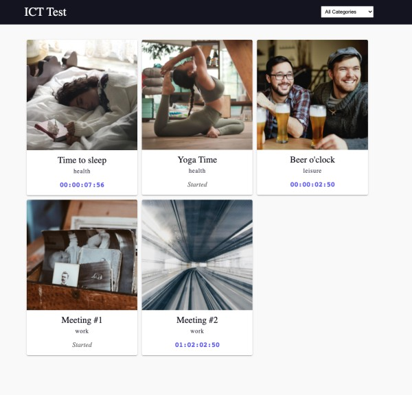

# ICT FE Developer Test

The main objective of this challenge is to test your FE skills

* Knowledge in JS and React
* UI/UX skills
* Your coding style
* Tests


## Rules
* Your code should be made available in a **private** repository on your personal Github.
* The test should not take more than 3 hours to complete. 
* Ideally, you can deliver the challenge within one week. But if you need more time, let us know 😊


## Description
You will implement the Page below. 



It's important to point out that this is just a prototype and does not need to be pixle-perfect. 😊

**Required**
* Countdown: The time to start has to tick down every second
* Possibility to filter the items based on category
* Test your code

**Bonus**
* Synchronize the countdowns to tick at the same time
* Visual optimizations
* Responsive


## About the "API"
In order to save time, we provide a helpers file `src/helpers.js`. This file exposes 3 functions:

1. **fetchCategories** returns `Promise<Category[]>`
2. **fetchCountdowns** returns `Promise<Countdown[]>`
3. **getImageSrc** takes `image` as argument and returns image `src`

**Data Structure**

```
type Category = {
  id: number
  name: string
}

type Countdown = {
  id: number
  categoryId: number
  title: string 
  image: string
  startsAt: string // UTC string 
}
```

## Instructions

* Install dependencies: `npm install`
* Start: `npm start`
* Test: `npm test`

After finishing the Challenge you could provide repo access to:

[@Front End ICT](https://github.com/orgs/ICT-Scandinavia/teams/front-end-ict)

Then send an email to <a href="mailto:dev@impactct.com">dev@impactct.com</a>, with:

* Title: [ICT FE Test] Your name;
* Repository link with your test.
* Information about you: Github, LinkedIn or anything else you consider important.

Good Luck!
